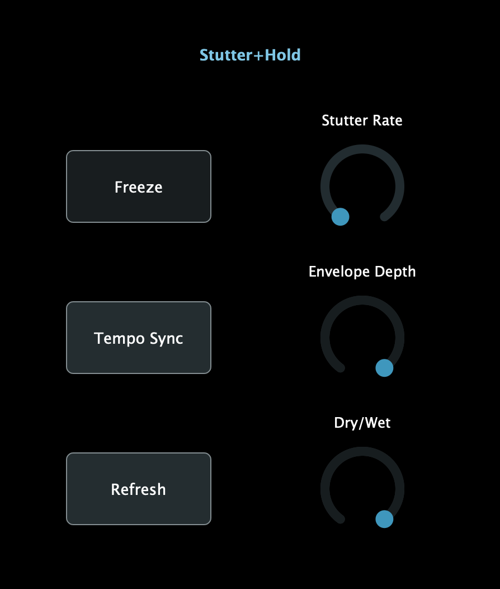

# Stutter+Hold
__Stutter+Hold__ ("Stutter and hold") is a timbral tremolo, basically a freeze pedal and tremolo combined. 

Under the hood it's built on a _phase vocoder_, but this is all really just an excuse to build up an overlap-add analysis synthesis class for JUCE.

## Effect parameters
- _Freeze_ sets the plugin to on or off.
- _Tempo Sync_ sets the stutter rate to sync with the DAW playback tempo.
- _Refresh_ is a manual trigger to grab a new frame to freeze on (only useful when Stutter Rate is set to 0).
- _Stutter Rate_ sets the freeze update rate in Hz.
- _Envelope Depth_ determines how much the effect (the frozen part) follows the amplitude envelope of the wet signal. Fun stuff.
- _Dry/Wet_ sets the mix of processed and unprocessed audio.

## The Overlap-add buffer class

The plugin uses an overlap-add buffer class which was designed to be general purpose. To use it, fill the buffer sample-by-sample with the `process` method. It will store the new value, and mutate the input sample into an output value. What a time to be alive.

Here's how it's working for now: inherit from the `OlaBuffer` class, which takes care of all the overlap adding. You'll have to implement a `processFrameBuffers` method, which is called every `hopSize` samples (i.e., whenever an overlapping frame is filled up). The `SimpleOlaProcessor` class does all the spectral processing here -- it inherits from `OlaBuffer` and does all the spectral phasey goodness.

_Certainly there is a better way to do this, but when in the vast and featureless landscape of C++, premature optimization is surely the root of all evil. Hope you enjoy._